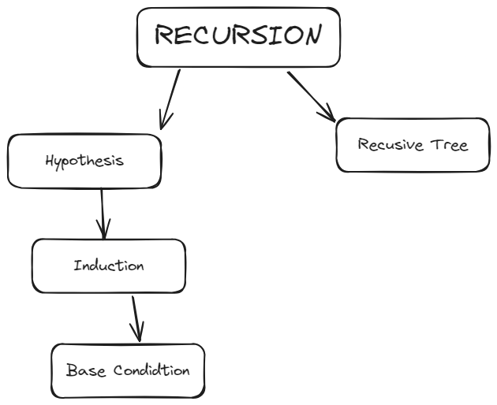
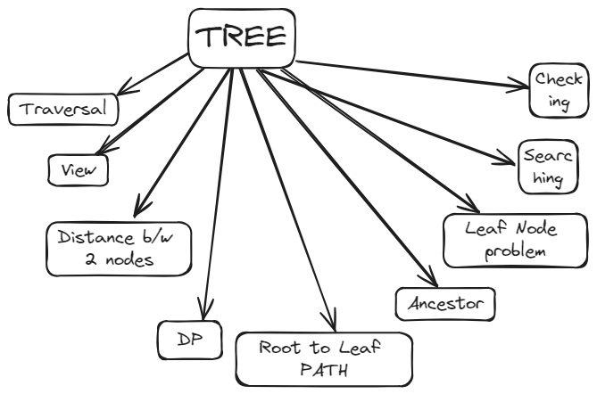
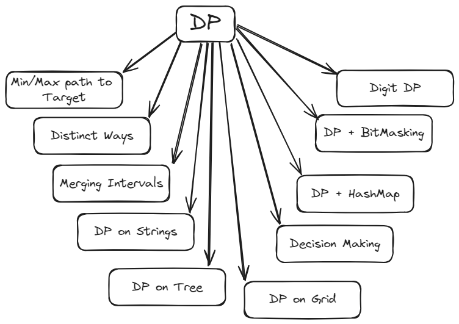
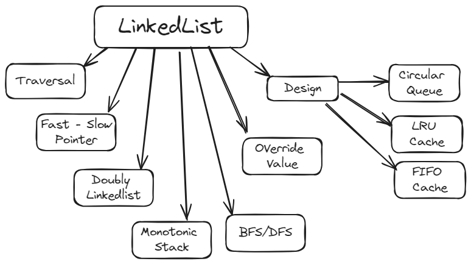
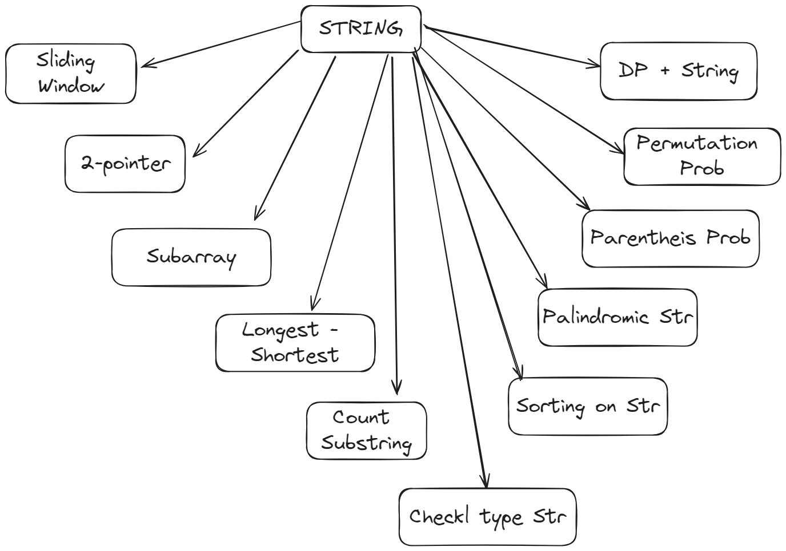
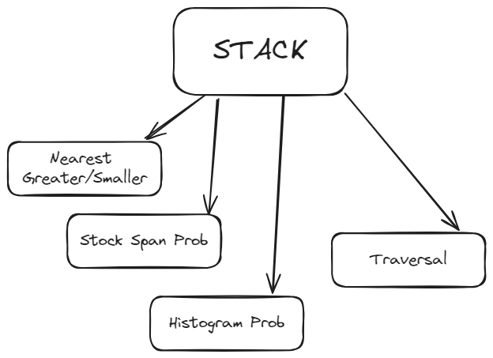
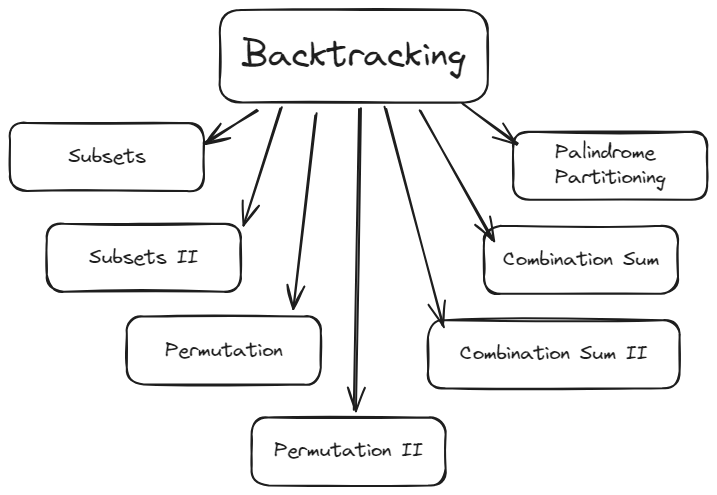

# [Roadmap]()

## [Recursion](https://leetcode.com/discuss/study-guide/1733447/become-master-in-recursion)

## [Tree 🔗](https://leetcode.com/discuss/study-guide/5020529/Master-Tree-Patterns)

## [Dynamic Programing]()

## [Linked List]()

## [String](https://leetcode.com/discuss/study-guide/2001789/Collections-of-Important-String-questions-Pattern)

## [Stack]()

## [Backtracking](https://leetcode.com/problems/permutations/solutions/18239/A-general-approach-to-backtracking-questions-in-Java-(Subsets-Permutations-Combination-Sum-Palindrome-Partioning)/)
