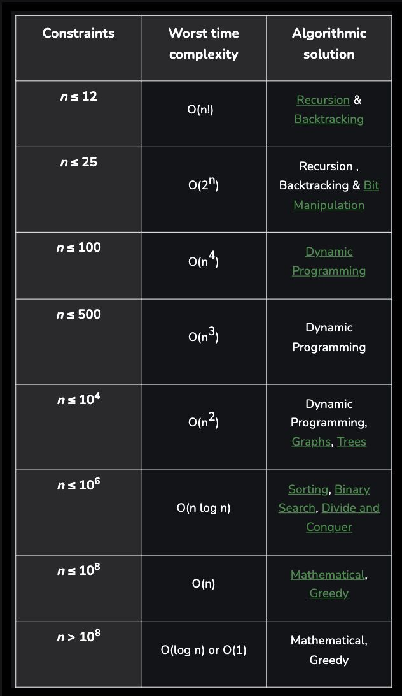

| ___ N ___ | ____ TC ____ | _____ Algo _____ |
|-----------|--------------|------------------|
|  <= 12    |    O(n!)     |   BT-Rec         |
|  <= 25    |    O(2^n)    |   Rec-BT-Bit     |
|  <= 100   |    O(n^4)    |   DP             |
|  <= 500   |    O(n^3)    |   DP             |
|  <= 10^4  |    O(n^2)    |   DP-Graph-Tree  |
|  <= 10^6  |    O(nLogN)  |   Sort-BS-DnC    |
|  <= 10^8  |    O(n)      |   Math-Greedy    |
|  <= 10^9  | O(logN)-O(1) |   Math-Greedy    |

