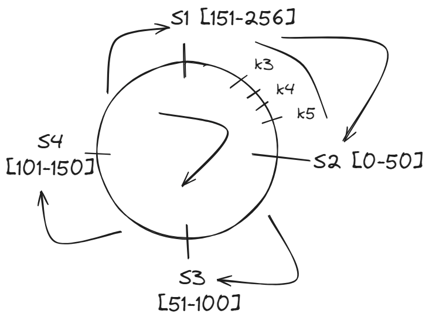
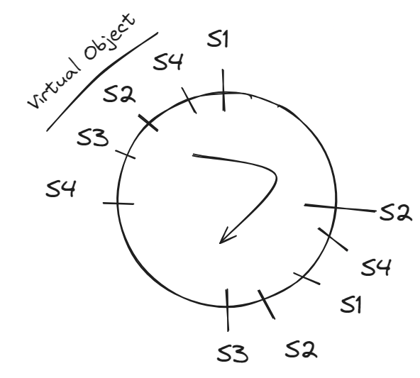

# Consitent Hashing
- Prerequiste
    1. Hashing
    2. What is the USE of CH?
    3. How CH Works?

## Hashing
- Hash-Table
    - | Index | Value |
    - |__ 0 __|_______|
    - |__ 1 __|_______|
    - |__ 2 __|_______|
    - |__ 3 __|_______|
    - |__ 4 __|_______|

- ---key--> [HASH_FUNCTION] --> Value
- Hash_Funciton => (Key % N) --> 18 % N --> 18%5 --> 3
    N: Size of table
    
MOD: it give index in the hashtable

## Problem with hashing?
- if N is fixed --> Hashing -- Perfect 
- if N is DYNAMIC --> Hashing -- Can't Handle

                  ---> S1 (3 rps)
---8 rps-->  [LB] ---> S2 (3 rps)
                  ---> S3 (2 rps)

- but if 1 Serivce add/removed -- need to RE-BALANCE
                  ---> S1 (2 rps)
---8 rps-->  [LB] ---> S2 (2 rps)
                  ---> S3 (2 rps)
                  ---> S4 (2 rps)

- this Re-Balance -- is very expensive -- assume happening on Billion RPS.
- Solution, Consisten Hahsing
    - allow only [(1/N)%] of Re-Balancing

## Consistent Hashing
- allow only [(1/N)%] of Re-Balancing
- it take [Virtual-Ring]()
    - say 256 point is there
    - having Service at 4 points (S1, S2, S3, S4)
    - let say,
    - S1 hanndle - traffic - coming at node [151-200]
    - S2 hanndle - traffic - coming at node [0-50]
    - S3 hanndle - traffic - coming at node [51-100]
    - S4 hanndle - traffic - coming at node [101-150]
    - see Image
       - 

    - now if S2 -- DOWN
        - all traffic will go to S3 [0 - 100]
        - need to "Re-Balance" previous load of S2 to S3.
    - to avoid -- Rebalance
    - we put -- [VIRTUAL OBJECT]()
        - put replica of Each service -- many place -- see Image
        - 
    - now Load is distrubted EVENLY -- even after On-Off any service

## Use:
- CH is used in:
    - Load Balancer -- distribute to servers
    - Horizontal Sharding -- DB
    - Cache Pool allotment