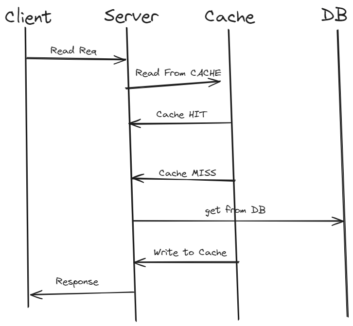
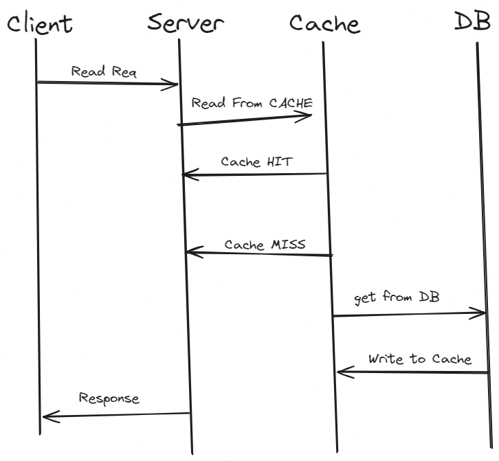
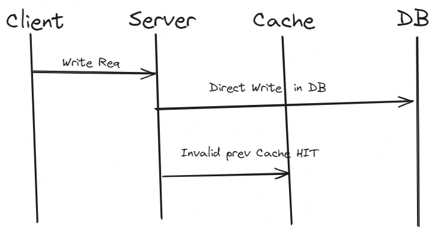
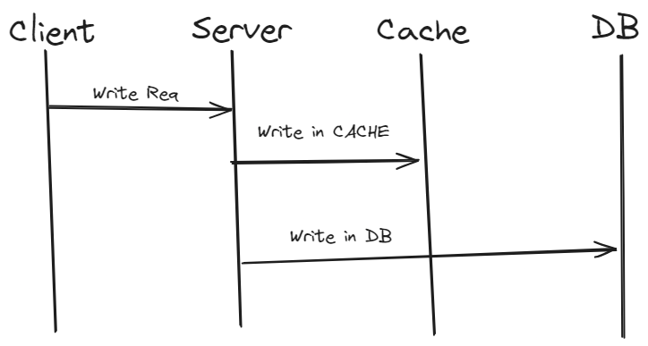
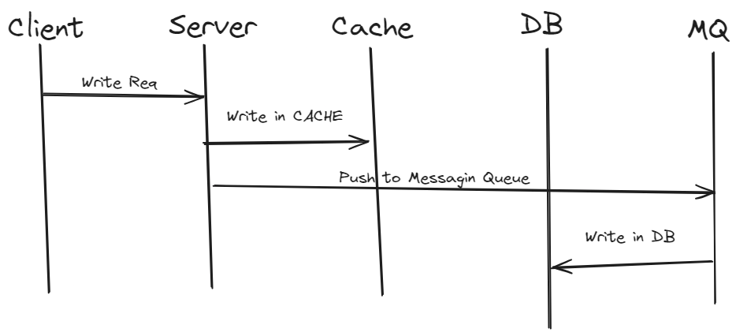

# Distributed Caching -- Strategy

## Cache
- store FREQUENTLY used data -- in RAM
- System - FAST
- Reduce Latency
- help in achieve -- Fault Tolerance

## Types of Cache
1. Client Side Cache (Browser caching)
2. CDN
3. Load Balancer
4. Server Side 

Client --> LB --> Server --> [Cache]() --> DB

## What if 1 Cache in Multi-Server?
```
S1 ---> 
S2 ---> 
    --> Cache
S3 ---> 
S4 ---> 
```
    - this become 
        -- Single Point Failure
        -- Sclability 

- Solution, Distributed Caching

## Distributed Caching
- we have Cache-Pool
CS1 - handle A-F
CS2 - G-M
CS3 - N-V
.....

```
S1 --> Cache-Client ---> 
            ---> Cache POOL[Cache Server 1, CS2, CS3]
S2 --> Cache-Client
```
- How cache server is alloted in Cache Pool?
    - Consitent Hashing

# Cache Client
    - know which Cache-Server -- support what range
    - etc


# Cache Pool
    - hold multi Cache Server
    - each cache server -- follows -- Leader(write) + followers(read replica)

## Strategy
1. Cache Aside
2. Read Through Cache
3. write Before Cache
4. write Through Cache
5. write After Cache

## 1. Cache Aside
- check in Cache
    - found -- Cache Hit
    - not found -- Cache Miss

- see Image,
    - 
- Pros:
    - good for Heavy Read System
    - cache - DOWN --> still req SUCESS --> get from DB
- Cons:
    - for WRITE -- cache Miss -- get from DB
    - client -- worry about getting DB from or Cache
    - write - Inconsitend bw DB & Cache is possible -- in Update Case
        - DB [10] -- Cache [10]
        - now write -- 11
        - DB [11] -- Cache[10]
        - in this time, Cache is not MISS -- but DB is updated to 11, so inconsistent

## 2. Read Through Cache

- Pros:
    - Good for Heavy Read
    - Cleint don't worry about -- get from DB or Cache
- Cons: 
    - write -- cache miss

## 3. write Before Cache
- it must used with READ algo(cache-aside or Read-thro-cache)
- directly write in DB
- do not update in Cache -- else -- mark it -- INVALID in cache

- Pros:
    - good for heavy read
    - resolve inconsitency bw DB & Cache
- Cons:
    - DB Fail -- Write FAIL

## 4. write Through Cache

- Pros:
    - Always consitent
    - Atomicity -- if DB fail -- Rollback from Cache
- Cons:
    - 2 phase commit
    - if DB or Cache- DOWN -- Write - Fail

## 5. write After Cache
- write ASYNC into DB
- See image
- Fault Tolerant -- is handle at DB
- PROS:
    - Good for Write Heavy
    - write latency -- less --> as ASYNC DB write
- CONS:
    - if expired in cache -- MQ still write in DB -- rare issue
    - Cache[TTL-3min] -->but MQ take 4 min -- so it get expired -- but still DB write happen after 4 min