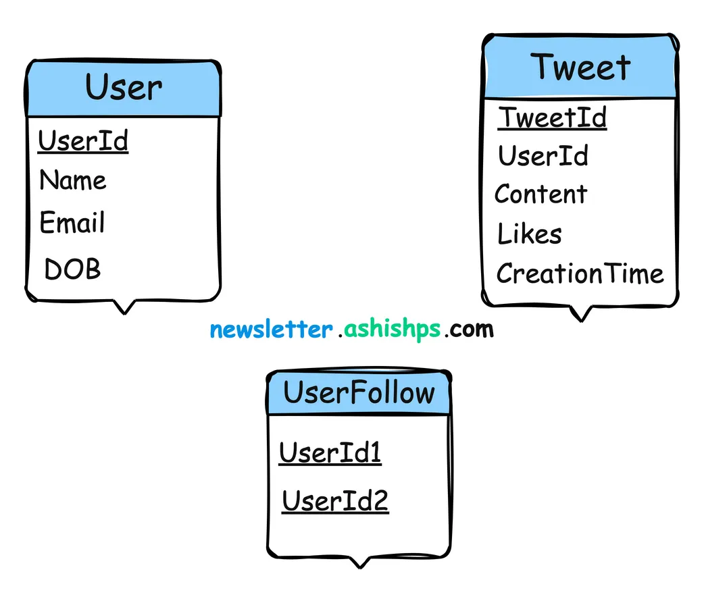

# How to Answer System Design Problem

## Steps:
1. Requirement Gathering
    - Functional
    - Non-Functional
2. Calculation
3. Design
4. DB design
5. API Design
6. Deep Dive
7. Address key issues: Scalability, Relaiability

## Requirement Gatherinh
### Funcational
1. core features?
2. feature critical than others?
3. customer of system?
4. user actions on sys?
5. user device?
6. data type handle?
7. 3rd party service?

### Non-Functional
1. expected scale?
2. data volume?
3. ip - op?
4. read-write ratio?
5. downtime? or high available?
6. latency requirement?
7. data consistency? eventual consitency?
8. performance? scalability? reliability?

## Db Design

## API 
